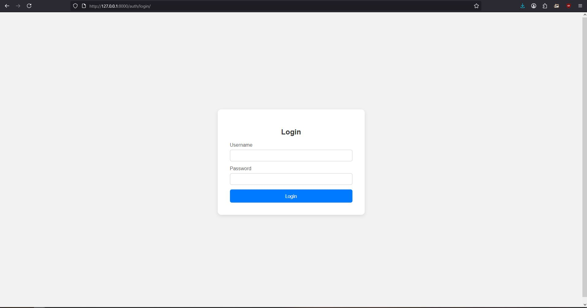
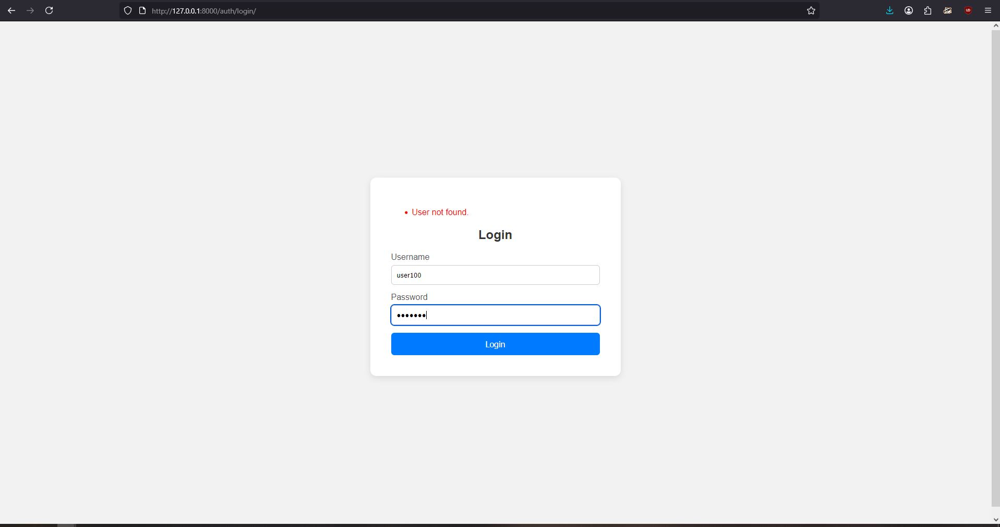
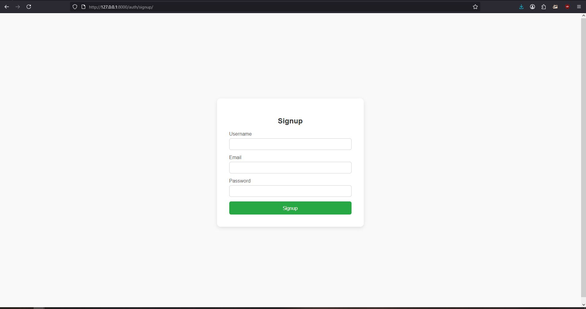
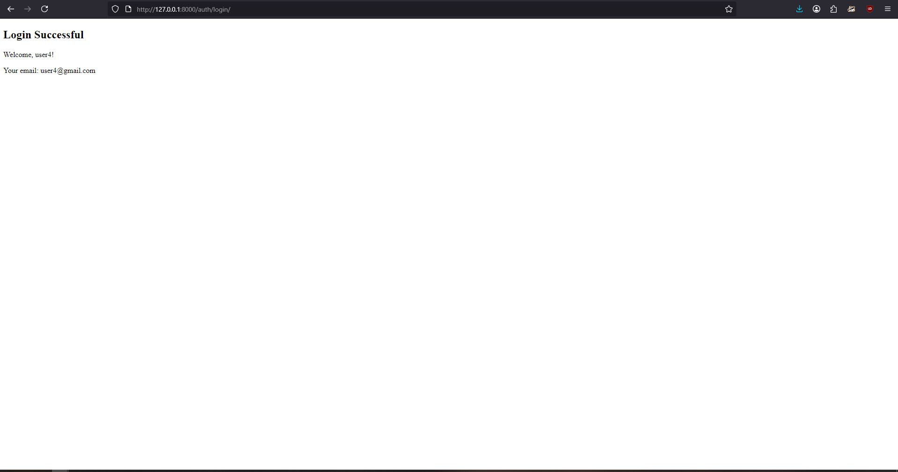
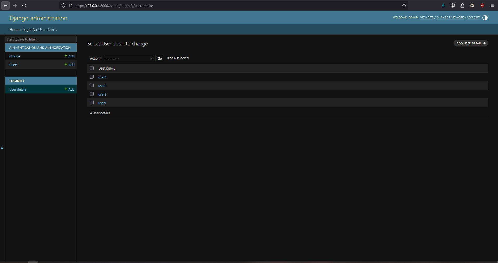
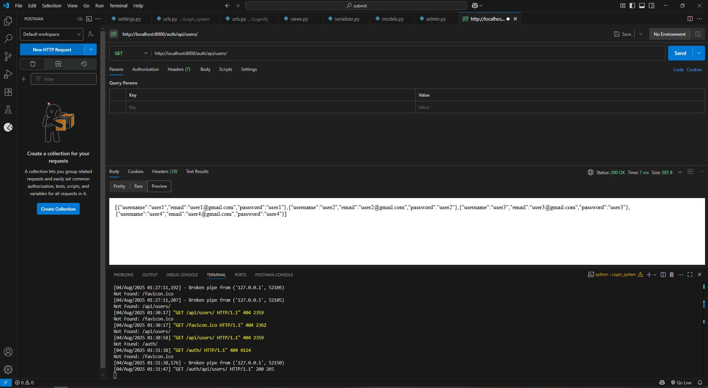
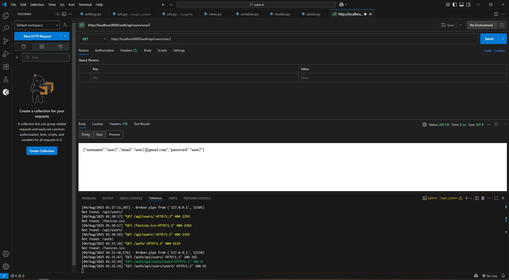
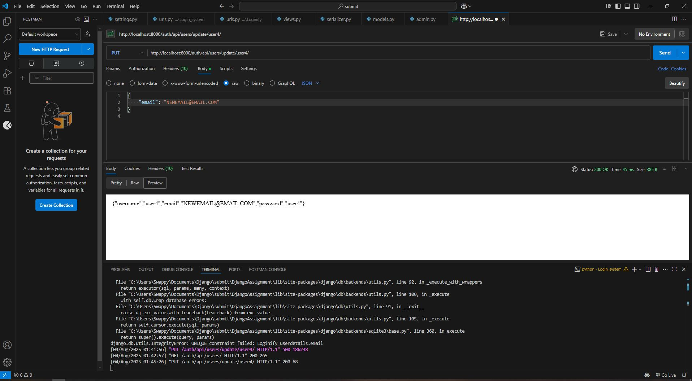
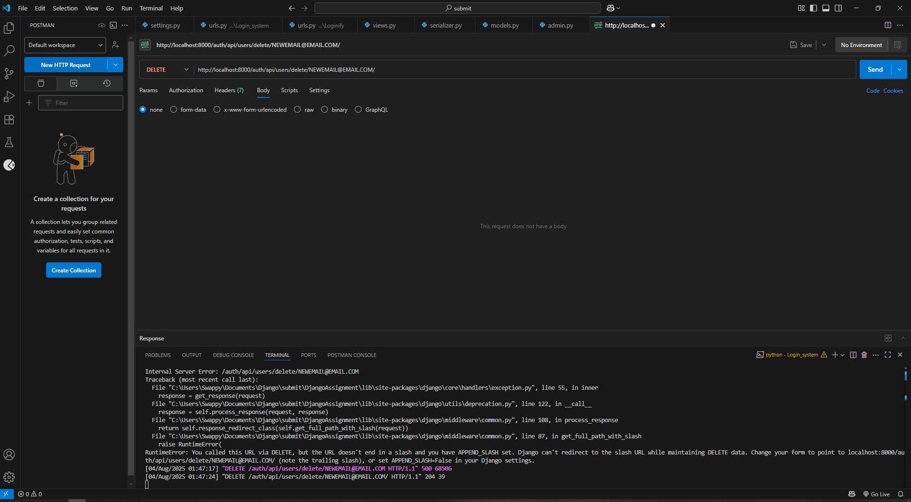
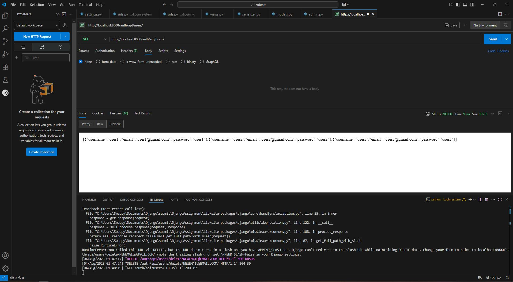

# Django Login System

A Django-based login system that allows users to register, log in and perform CRUD operations on user data through both HTML pages and REST APIs. This project demonstrates user authentication, template rendering, and API testing using Postman.

---

## 🚀 Features

- User Signup and Login
- Unique validation for email and username
- Fully styled HTML/CSS frontend
- REST API endpoints for CRUD operations
- Superuser admin panel
- Postman-ready API testing

---

## Login page:
### You can login with your credentials. 
<p align="center">
  
</p>

### Your username and password is validated and upon incorrect details it will prompt you!
<p align="center">
  
</p>

## Signup page:
### On signup-landing page you have to enter all the details and it will redirect you to login page!
<p align="center">
  
</p>

### After your details are validated upon login, you'll see success page!
<p align="center">
  
</p>

## Admin panel:
### This is where you can see all your objects that are created and all its details! You can also create groups and grant/revoke access for particular individuals and groups based on different scenarios!
<p align="center">
  
</p>
<br>

## Postman API testing:
### GET METHOD: Testing URL below to see if i can see all my objects and its details just like admin panel! 
```bash
    http://localhost:8000/auth/api/users/
   ```
<p align="center">
  
</p>

### GET METHOD: Testing URL below to see if i can see specific details for a user! 
```bash
    http://localhost:8000/auth/api/users/user2/
   ```
<p align="center">
  
</p>

### PUT METHOD: Testing URL below to see if i can update my existing object details using username! I am changing email from 'user4@gmail.com' to 'NEWEMAIL@EMAIL.COM'!
```bash
    http://localhost:8000/auth/api/users/user4/
   ```
<p align="center">
  
</p>

### DELETE METHOD: Testing URL below to see if i can delete objects using email! 
```bash
    http://localhost:8000/auth/api/users/user2/NEWEMAIL@EMAIL.COM/
   ```
<p align="center">
  
</p>
<br>
<p align="center">
  
</p>
<br>


